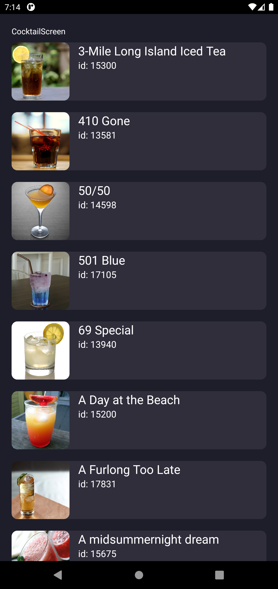
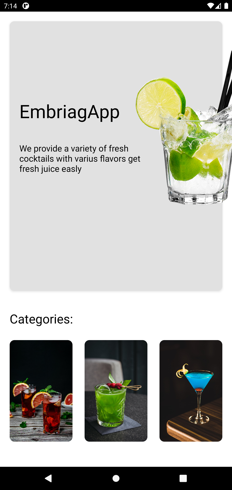
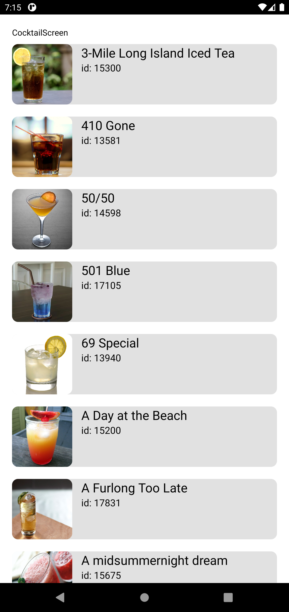
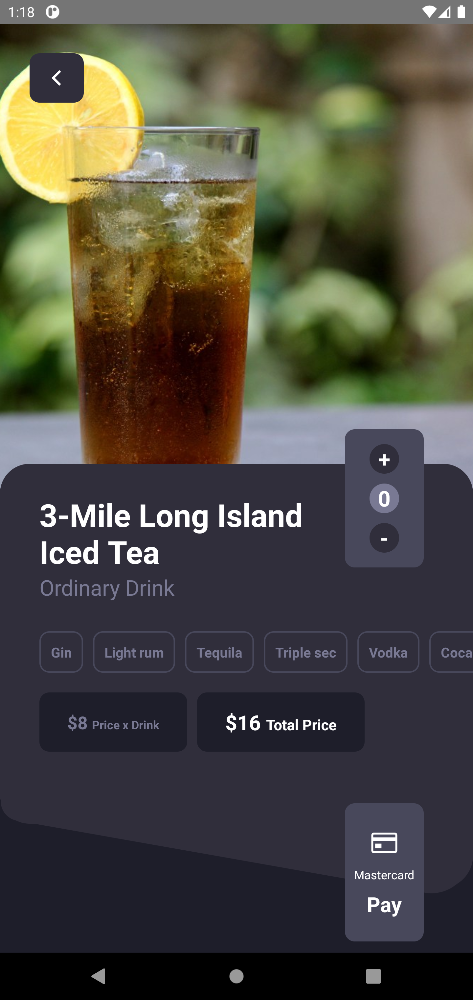
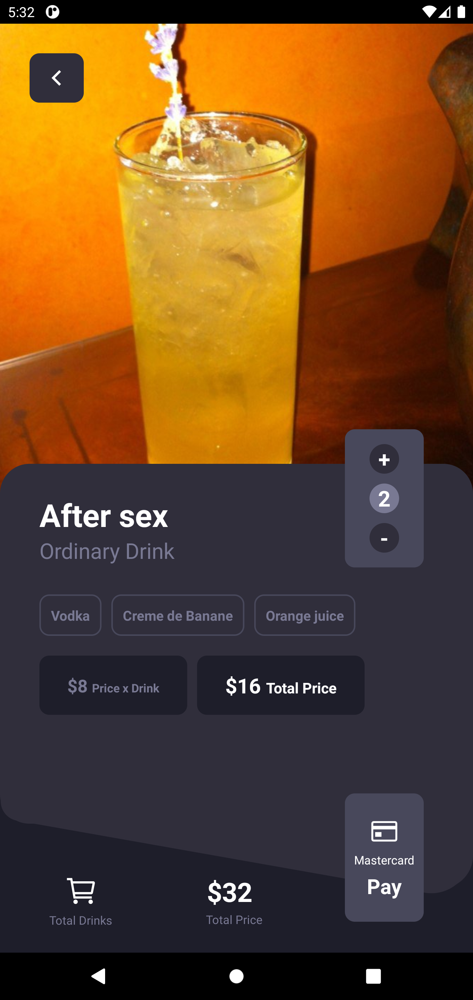

# React Native Cocktail APP

## Information 🚀

The objective of this project is to practice consuming a cocktail api with a modern design.

### Components 📋

- FlatList
- Theme dark and white

And more!

### Current progress 👷🏾‍♂️

